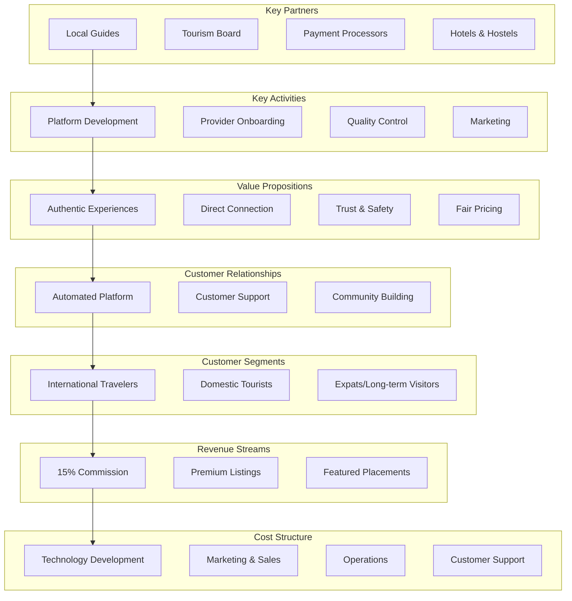

# 🗿 MayaGo - Authentic Mayan Experiences Platform

<div align="center">


**Connecting travelers with authentic local experiences in the Yucatan Peninsula**

[View Demo](http://localhost:5000) • [Documentation](#documentation) • [Team](#team)

</div>

---

## 📑 Table of Contents

1. [Executive Summary](#executive-summary)
2. [Introduction](#introduction)
3. [Problem Statement](#problem-statement)
4. [Business Model](#business-model)
5. [Target Audience](#target-audience)
6. [Value Proposition](#value-proposition)
7. [Digital Platform Architecture](#digital-platform-architecture)
8. [Revenue Model & Cost Structure](#revenue-model--cost-structure)
9. [Economic, Social & Technological Impact](#economic-social--technological-impact)
10. [Market Analysis](#market-analysis)
11. [Implementation Strategy](#implementation-strategy)
12. [Conclusions & Recommendations](#conclusions--recommendations)

---

## 🎯 Executive Summary

**MayaGo** is a collaborative economy platform designed to connect international and domestic travelers directly with local experience providers in the Yucatan Peninsula. By leveraging digital technologies, we democratize access to authentic tourism experiences while generating sustainable economic impact for Mayan communities.

### Key Highlights

- 🌍 **Market Size**: 3.2M+ tourists visit Yucatan annually
- 💰 **Revenue Model**: 15% commission on bookings
- 🚀 **Technology**: Web platform + Mobile-responsive design
- 🌱 **Social Impact**: Direct income to 500+ local families (Year 1 target)
- 📈 **Scalability**: Replicable model across Latin America

---

## 📖 Introduction

### Context

The digital economy has transformed traditional industries, with the tourism sector experiencing one of the most significant disruptions. Platforms like Airbnb, Uber, and GetYourGuide have demonstrated that peer-to-peer marketplaces can create immense value by connecting supply and demand directly.

In Yucatan, Mexico, despite being one of the country's top tourism destinations, there exists a significant gap: **local experience providers lack digital tools to reach international travelers**, while tourists seek authentic, off-the-beaten-path experiences that large tour operators don't offer.

### The Opportunity

Yucatan receives over **3.2 million tourists annually**, with growth trends showing:
- 25% prefer experiential tourism over traditional tours
- 60% actively search for "authentic local experiences"
- 40% book activities online before arrival

However, **70% of tourism revenue** is captured by large corporations, leaving local communities with minimal economic benefit.

---

## 🔍 Problem Statement

### Current Challenges

#### For Travelers
- **Information Asymmetry**: Difficult to find authentic local experiences beyond TripAdvisor
- **Trust Issues**: No verified platform for booking with independent guides
- **Language Barriers**: Most local providers don't speak English
- **Payment Friction**: Cash-only transactions create security concerns

#### For Local Providers
- **Limited Digital Presence**: Most rely on word-of-mouth or hotel referrals
- **No Marketing Tools**: Cannot reach tourists directly
- **Payment Processing**: Lack access to online payment systems
- **Seasonality**: Income concentrated in high season only

#### Market Gap
Traditional tour operators focus on **mass tourism** (buses, group tours), while the growing segment of **experiential travelers** remains underserved.

---

## 💼 Business Model

### Business Model Canvas



### Platform Type
**Two-sided marketplace** (Peer-to-peer platform)

### Core Components
1. **Supply Side**: Local experience providers (guides, artisans, chefs, families)
2. **Demand Side**: Travelers seeking authentic experiences
3. **Platform**: Digital infrastructure connecting both sides

---

## 👥 Target Audience

### Primary Segments

#### 1. Conscious Travelers (60% of target)
- **Age**: 25-45 years
- **Income**: $40,000 - $100,000 USD/year
- **Values**: Sustainability, cultural immersion, authentic experiences
- **Behavior**: Research extensively, book online, share on social media
- **Origin**: USA (45%), Europe (30%), Canada (15%), Other (10%)

#### 2. Digital Nomads (25% of target)
- **Age**: 28-40 years
- **Income**: $50,000+ USD/year
- **Values**: Unique experiences, community connection, flexibility
- **Behavior**: Long stays, repeat bookings, influencer potential
- **Origin**: USA, Canada, Germany, UK

#### 3. Domestic Adventure Seekers (15% of target)
- **Age**: 30-55 years
- **Income**: $20,000 - $50,000 USD/year (Mexican market)
- **Values**: National pride, cultural discovery
- **Behavior**: Weekend trips, family groups

### Secondary Segment
- Corporate groups seeking team-building experiences
- Educational institutions organizing cultural trips

---

## 💎 Value Proposition

### For Travelers

#### Unique Selling Points
1. **Authenticity Guaranteed**
   - Direct connection with local families and communities
   - No intermediaries or commercialized tours
   - Real stories, real people, real culture

2. **Trust & Safety**
   - Verified providers with reviews and ratings
   - Secure online payment processing
   - Clear cancellation policies
   - 24/7 customer support

3. **Fair Pricing**
   - 30-40% cheaper than traditional tour operators
   - Transparent pricing with no hidden fees
   - Money goes directly to local communities

4. **Convenience**
   - Book in advance from anywhere
   - Multi-language platform (English, Spanish, French, German)
   - Instant confirmation
   - Digital itinerary management

### For Local Providers

#### Benefits
1. **Digital Transformation**
   - Free professional profile page
   - Booking management system
   - Automatic calendar synchronization
   - Customer communication tools

2. **Market Access**
   - Reach international travelers directly
   - No need for marketing knowledge
   - Platform handles promotion and SEO

3. **Financial Inclusion**
   - Accept international payments securely
   - Receive payouts weekly
   - Track earnings in real-time
   - No upfront costs

4. **Business Growth**
   - Analytics on bookings and customer preferences
   - Seasonal income smoothing through diversification
   - Training and best practices support

---

## 🖥️ Digital Platform Architecture

### System Architecture

```mermaid
graph LR
    A[User Interface<br/>Web + Mobile] --> B[API Gateway]
    B --> C[Application Layer]
    C --> D[Database Layer]
    C --> E[External Services]
    
    subgraph "Frontend"
        A
    end
    
    subgraph "Backend Services"
        C --> C1[User Management]
        C --> C2[Booking Engine]
        C --> C3[Payment Processing]
        C --> C4[Search & Recommendations]
        C --> C5[Messaging System]
    end
    
    subgraph "Data Storage"
        D --> D1[PostgreSQL<br/>User & Booking Data]
        D --> D2[Redis Cache<br/>Session Management]
        D --> D3[S3 Storage<br/>Images & Files]
    end
    
    subgraph "Third Party"
        E --> E1[Stripe Payments]
        E --> E2[Google Maps API]
        E --> E3[SendGrid Email]
        E --> E4[Twilio SMS]
    end
```



### Technology Stack

#### Frontend
- **Framework**: React.js with Next.js for SEO optimization
- **UI Library**: Tailwind CSS + Custom components
- **State Management**: Redux Toolkit
- **Mobile**: Progressive Web App (PWA) for mobile experience

#### Backend
- **Framework**: Flask (Python) / Node.js with Express
- **API**: RESTful API with JWT authentication
- **Real-time**: WebSocket for messaging
- **Task Queue**: Celery with Redis for async jobs

#### Database
- **Primary**: PostgreSQL (relational data)
- **Cache**: Redis (sessions, real-time data)
- **Search**: Elasticsearch (full-text search)
- **Storage**: AWS S3 (images, documents)

#### Infrastructure
- **Hosting**: AWS / DigitalOcean
- **CDN**: CloudFlare
- **Monitoring**: Sentry + Google Analytics
- **CI/CD**: GitHub Actions

### Core Features

#### 1. Discovery & Search
- Advanced filtering (price, location, activity type, duration)
- Map-based exploration
- Personalized recommendations using collaborative filtering
- Multi-language search with NLP

#### 2. Booking System
- Real-time availability calendar
- Instant booking or request-to-book options
- Group booking capabilities
- Flexible cancellation policies

#### 3. Payment Processing
- Secure payment gateway (Stripe)
- Multi-currency support
- Split payments (platform fee + provider payout)
- Automatic invoicing

#### 4. Review & Rating System
- Two-way reviews (travelers rate providers, providers rate travelers)
- Photo upload capability
- Moderation system for quality control
- Response management for providers

#### 5. Messaging Platform
- In-app chat between travelers and providers
- Automatic translation
- Pre-booking questions
- Post-booking coordination

#### 6. Provider Dashboard
- Booking calendar management
- Earnings analytics
- Customer communication hub
- Performance metrics and insights

---

## 💰 Revenue Model & Cost Structure

### Revenue Streams

#### Primary Revenue: Platform Commission (95% of revenue)
- **15% commission** on every confirmed booking
- Example: $100 experience → $15 to MayaGo, $85 to provider
- Industry standard: 10-20% (Airbnb: 14%, GetYourGuide: 30%)

#### Secondary Revenue (5% of revenue)
1. **Premium Listings** ($50/month)
   - Featured placement in search results
   - Badge on profile
   - Priority customer support

2. **Photography Services** ($150 one-time)
   - Professional photos for provider listings
   - Increases booking conversion by 40%

3. **Sponsored Content**
   - Tourism board partnerships
   - Destination marketing fees

### Financial Projections (Year 1-3)

| Metric | Year 1 | Year 2 | Year 3 |
|--------|--------|--------|--------|
| **Active Providers** | 150 | 400 | 750 |
| **Total Bookings** | 5,000 | 18,000 | 45,000 |
| **Avg. Booking Value** | $80 | $85 | $90 |
| **Gross Booking Value (GBV)** | $400,000 | $1,530,000 | $4,050,000 |
| **Platform Revenue (15%)** | $60,000 | $229,500 | $607,500 |
| **Operating Costs** | $85,000 | $180,000 | $350,000 |
| **Net Income** | -$25,000 | $49,500 | $257,500 |

### Cost Structure

#### Fixed Costs (Annual)
- **Technology**: $24,000/year
  - Hosting & infrastructure: $12,000
  - Software licenses: $6,000
  - Development tools: $6,000

- **Personnel**: $48,000/year (Year 1)
  - 2 Full-time employees
  - Part-time customer support

- **Legal & Administrative**: $5,000/year
  - Business registration
  - Insurance
  - Accounting

#### Variable Costs
- **Payment Processing**: 2.9% + $0.30 per transaction
- **Marketing**: 15% of revenue
  - Digital advertising (Google, Facebook, Instagram)
  - Content creation
  - Influencer partnerships

- **Customer Support**: $5 per booking
  - Chat support
  - Issue resolution

### Unit Economics

```
Average Booking Value: $80
Platform Commission (15%): $12
Payment Processing (3%): -$2.40
Variable Costs: -$2.60
Contribution Margin: $7.00 per booking

Break-even: ~12,150 bookings/year
Monthly: ~1,013 bookings/month
```

---

## 🌍 Economic, Social & Technological Impact

### Economic Impact

#### Micro-Level (Local Providers)
- **Income Generation**: Average provider earns $800-1,500/month additional income
- **Financial Inclusion**: 80% of providers gain first digital income source
- **Employment**: Indirect jobs created (translators, drivers, assistants)
- **Multiplier Effect**: Every $1 spent generates $2.50 in local economy

#### Meso-Level (Regional Economy)
- **Tourism Diversification**: Reduces dependency on large resorts
- **Year-round Income**: Extends tourist season through niche experiences
- **Infrastructure Development**: Incentivizes improvement of rural roads, internet access
- **SME Growth**: Providers scale from individuals to small businesses

#### Macro-Level (National)
- **GDP Contribution**: Increases tourism's share in regional GDP
- **Foreign Exchange**: Direct international payments to local providers
- **Tax Revenue**: Formalization of informal economy (VAT, income tax)

### Social Impact

#### Community Empowerment
- **Cultural Preservation**: Economic incentive to maintain traditions
- **Women Empowerment**: 60% of providers are women-led households
- **Youth Opportunities**: Prevents migration to cities by creating local jobs
- **Indigenous Rights**: Mayan communities control their cultural narrative

#### Capacity Building
- **Digital Literacy**: Training programs for providers (200+ trained/year)
- **Entrepreneurship**: Business skills development
- **Language Skills**: English classes for providers
- **Safety Standards**: First aid and customer service training

#### Sustainable Tourism
- **Environmental Awareness**: Eco-friendly practices incentivized
- **Visitor Management**: Distributes tourists across region (reduces overtourism)
- **Cultural Respect**: Educational content for travelers

### Technological Impact

#### Digital Transformation
- **Payment Systems**: Introduces digital payments to cash-based communities
- **Internet Penetration**: Drives demand for better connectivity
- **Tech Adoption**: Smartphone usage for business purposes
- **Data-Driven Decisions**: Analytics help providers optimize offerings

#### Innovation Spillover
- **Platform Economy**: Template for other sectors (agriculture, crafts)
- **Open Source**: Share learnings with other community platforms
- **API Economy**: Integration with other tourism services

---

## 📊 Market Analysis

### Market Size & Opportunity

#### Total Addressable Market (TAM)
- **Global Experiential Tourism**: $183 billion (2024)
- **Latin America**: $15 billion
- **Mexico**: $4.2 billion

#### Serviceable Addressable Market (SAM)
- **Yucatan Peninsula Tourism**: $2.1 billion/year
- **Experiential Tourism Segment**: $525 million (25%)

#### Serviceable Obtainable Market (SOM)
- **Target (Year 3)**: $4 million GBV (0.8% market share)
- **Realistic considering**: Airbnb Experiences captured 2-3% in mature markets

### Competitive Analysis

| Competitor | Strengths | Weaknesses | Our Advantage |
|------------|-----------|------------|---------------|
| **GetYourGuide** | Global reach, brand recognition | Generic experiences, high commissions (30%) | Local focus, lower fees (15%) |
| **Viator (TripAdvisor)** | Massive user base | No direct booking, complicated UX | Direct booking, simple UX |
| **Airbnb Experiences** | Strong brand, payment trust | Limited in Mexico, less authentic | Mexico-specific, curated local experiences |
| **Local Tour Operators** | Established relationships | No online presence, cash-only | Digital platform, online payments |
| **Informal Networks** | Authentic, cheap | No trust/safety, language barriers | Platform trust + local authenticity |

### Competitive Advantages (Moats)

1. **Network Effects**: More travelers attract more providers, vice versa
2. **Local Expertise**: Deep understanding of Yucatan culture and communities
3. **Trust & Safety**: Verified providers reduce risk for first-time users
4. **Technology**: Proprietary algorithms for matching travelers with experiences
5. **Brand**: Positioned as the "go-to" for authentic Yucatan experiences

---

## 🚀 Implementation Strategy

### Phase 1: MVP Launch (Months 1-6)

#### Goals
- Launch platform with 50 providers
- Achieve 500 bookings
- Validate product-market fit

#### Key Activities
1. **Product Development**
   - Build core platform features
   - Mobile-responsive design
   - Payment integration (Stripe)

2. **Provider Onboarding**
   - Recruit 50 initial providers (quality over quantity)
   - Create high-quality listings (professional photos)
   - Training workshops

3. **Go-to-Market**
   - Launch in Merida first (test market)
   - Partner with 3-5 hostels/hotels for referrals
   - Social media organic growth (Instagram, TikTok)
   - SEO optimization for "Yucatan authentic experiences"

#### Budget: $40,000
- Development: $20,000
- Marketing: $10,000
- Operations: $10,000

### Phase 2: Growth (Months 7-18)

#### Goals
- Scale to 200 providers
- 5,000 bookings
- Expand to Playa del Carmen, Tulum, Valladolid

#### Key Activities
1. **Geographic Expansion**
   - Hire regional coordinators
   - Replicate onboarding process

2. **Marketing Scale-up**
   - Paid advertising (Google, Meta)
   - Influencer partnerships (micro-influencers)
   - Content marketing (blog, YouTube)

3. **Product Enhancement**
   - Mobile app launch
   - Advanced search filters
   - Personalized recommendations

#### Budget: $150,000
- Marketing: $75,000
- Product: $40,000
- Operations: $35,000

### Phase 3: Maturity (Months 19-36)

#### Goals
- 750 providers
- 45,000 bookings/year
- Profitability achieved
- Expand to neighboring states (Quintana Roo, Campeche)

#### Key Activities
1. **Market Leadership**
   - Become the default platform for Yucatan experiences
   - Strategic partnerships (airlines, travel agencies)

2. **Internationalization**
   - Multi-language support (add French, German, Mandarin)
   - International payment methods

3. **Technology Innovation**
   - AI-powered recommendations
   - Dynamic pricing algorithms
   - Virtual reality previews

---

## 📈 Success Metrics (KPIs)

### North Star Metric
**Gross Booking Value (GBV)**: Total value of all bookings on platform

### Primary KPIs

| Category | Metric | Target (Year 1) |
|----------|--------|-----------------|
| **Growth** | Monthly Active Providers | 150 |
| **Growth** | Monthly Bookings | 420 |
| **Revenue** | Average Booking Value | $80 |
| **Retention** | Provider Retention Rate | 70% |
| **Retention** | Customer Repeat Rate | 25% |
| **Quality** | Average Review Rating | 4.7/5.0 |
| **Efficiency** | Customer Acquisition Cost | $25 |
| **Efficiency** | Lifetime Value (LTV) | $150 |

### Secondary KPIs
- Website traffic & conversion rate
- Social media engagement
- Provider earnings (avg. per month)
- Time to first booking (for new providers)

---

## ✅ Conclusions

### Key Findings

1. **Market Opportunity is Significant**
   - $525M experiential tourism market in Yucatan with minimal digital penetration
   - Growing traveler demand for authentic, local experiences
   - Underserved provider segment eager for digital tools

2. **Business Model is Viable**
   - Proven peer-to-peer marketplace model (Airbnb, Uber precedents)
   - Sustainable unit economics with 15% commission
   - Path to profitability by Year 2

3. **Technology Enables Scale**
   - Digital platform reduces transaction costs dramatically
   - Network effects create competitive moats
   - Data-driven optimization improves matching over time

4. **Social Impact is Real**
   - Direct economic benefit to marginalized communities
   - Preserves cultural heritage through economic incentives
   - Empowers women and indigenous populations

5. **Competitive Advantages are Defensible**
   - Local expertise and relationships
   - Lower commission structure attracts providers
   - Purpose-built for Yucatan (not generic global platform)

### Strategic Implications

**MayaGo represents a convergence of three powerful trends:**
- Digital economy disruption of traditional industries
- Shift toward sustainable and experiential tourism
- Growing economic opportunities for emerging markets

The platform creates a **triple-win scenario**:
- Travelers get authentic experiences at fair prices
- Providers gain market access and sustainable income
- The platform generates revenue while creating social impact

---

## 🎯 Recommendations

### For Immediate Implementation

1. **Start Small, Think Big**
   - Focus MVP on Merida only (quality over geographic reach)
   - Onboard 50 excellent providers rather than 200 mediocre ones
   - Perfect the model before scaling

2. **Prioritize Trust & Safety**
   - Implement rigorous provider verification
   - Build robust review system from day one
   - Invest in customer support infrastructure

3. **Leverage Local Partnerships**
   - Partner with tourism board for credibility
   - Collaborate with hostels/hotels for customer acquisition
   - Work with local NGOs for provider training

4. **Build for Mobile First**
   - 70% of travelers book experiences on mobile
   - Progressive Web App (PWA) before native apps
   - Optimize for slow internet connections (rural areas)

### For Long-term Success

1. **Technology as Competitive Advantage**
   - Invest in machine learning for personalization
   - Build proprietary algorithms for matching
   - Create data flywheel (more data → better recommendations → more usage)

2. **Community-Centric Approach**
   - Treat providers as partners, not suppliers
   - Regular feedback sessions with provider community
   - Share success stories and best practices

3. **Sustainable Growth**
   - Resist pressure to scale prematurely
   - Maintain quality standards as you grow
   - Balance growth with profitability

4. **Prepare for Competition**
   - Large players (Airbnb, Google) will eventually enter
   - Build strong brand loyalty and community
   - Consider acquisition as potential exit strategy

### Risk Mitigation

| Risk | Impact | Mitigation Strategy |
|------|--------|---------------------|
| **Low adoption by providers** | High | Extensive training, success stories, low/no upfront costs |
| **Trust issues** | High | Verification system, insurance, 24/7 support |
| **Seasonality** | Medium | Promote off-season experiences, domestic tourism |
| **Competition from giants** | Medium | Deep local focus, better provider economics |
| **Technology failures** | High | Redundant systems, monitoring, backups |
| **Regulatory changes** | Low | Legal counsel, industry association membership |

---

## 👥 Team

**Project Team Members:**
- [Team Member 1] - Product & Technology
- [Team Member 2] - Business & Operations  
- [Team Member 3] - Marketing & Community
- [Team Member 4] - Finance & Analytics

**Institution:** [University Name]  
**Program:** Digital Economy  
**Date:** November 2024

---

## 📚 References & Resources

### Academic Sources
1. Parker, G., Van Alstyne, M., & Choudary, S. P. (2016). *Platform Revolution*. W. W. Norton & Company.
2. Sundararajan, A. (2016). *The Sharing Economy: The End of Employment and the Rise of Crowd-Based Capitalism*. MIT Press.
3. Guttentag, D. (2019). "Progress on Airbnb: a literature review." *Journal of Hospitality and Tourism Technology*, 10(4), 814-844.

### Market Research
- SECTUR Mexico Tourism Statistics (2024)
- Yucatan Tourism Board Annual Report (2023)
- Phocuswright Travel Research: Experiential Tourism Trends (2024)
- World Tourism Organization (UNWTO) - Sustainable Tourism Development

### Technology References
- Stripe Payment Platform Documentation
- Google Cloud Platform - Travel & Hospitality Solutions
- Harvard Business Review: Platform Business Models

---

## 📞 Contact & Links

- **GitHub Repository**: [github.com/yourusername/mayago](https://github.com/yourusername/mayago)
- **Live Demo**: [mayago-demo.com](http://localhost:5000)
- **Documentation**: [See /docs folder](./docs)
- **Presentation**: [View Slides](./docs/presentation)

---

<div align="center">

**Built with ❤️ for the Mayan communities of Yucatan**

*"Connecting cultures, one experience at a time"*

</div>