# 🎯 MayaGo - Business Model Canvas

## Visual Representation

```mermaid
graph TB
    subgraph "KEY PARTNERS"
        KP1["🤝 Local Experience Providers<br/>(Guides, Families, Artisans)"]
        KP2["🏛️ Yucatan Tourism Board"]
        KP3["💳 Payment Processors<br/>(Stripe, PayPal)"]
        KP4["🏨 Hotels & Hostels<br/>(Referral Partners)"]
        KP5["📱 Technology Vendors<br/>(AWS, Google Cloud)"]
    end

    subgraph "KEY ACTIVITIES"
        KA1["💻 Platform Development<br/>& Maintenance"]
        KA2["👥 Provider Onboarding<br/>& Training"]
        KA3["✅ Quality Control<br/>& Verification"]
        KA4["📢 Marketing & SEO"]
        KA5["🛡️ Trust & Safety<br/>Management"]
    end

    subgraph "VALUE PROPOSITIONS"
        VP1["🌟 For Travelers:<br/>Authentic Local Experiences"]
        VP2["🔒 Trust & Safety<br/>(Verified Providers)"]
        VP3["💰 Fair Pricing<br/>(30-40% cheaper)"]
        VP4["📱 For Providers:<br/>Digital Market Access"]
        VP5["💵 Financial Inclusion<br/>(Online Payments)"]
    end

    subgraph "CUSTOMER RELATIONSHIPS"
        CR1["🤖 Automated Platform<br/>(Self-service Booking)"]
        CR2["💬 24/7 Customer Support"]
        CR3["👥 Community Building<br/>(Reviews & Forums)"]
        CR4["📧 Personalized Marketing<br/>(Email & Push)"]
    end

    subgraph "CUSTOMER SEGMENTS"
        CS1["🌍 International Travelers<br/>(USA, Europe, Canada)<br/>Age: 25-45, Income: $40k-100k"]
        CS2["💼 Digital Nomads<br/>(Remote Workers)<br/>Age: 28-40, Long Stays"]
        CS3["🇲🇽 Domestic Tourists<br/>(Mexican Travelers)<br/>Age: 30-55, Weekend Trips"]
        CS4["🏢 Corporate Groups<br/>(Team Building)"]
    end

    subgraph "KEY RESOURCES"
        KR1["🖥️ Technology Platform<br/>(Web & Mobile)"]
        KR2["📊 User Database<br/>(Travelers & Providers)"]
        KR3["👨‍💼 Team<br/>(Tech, Ops, Support)"]
        KR4["🏆 Brand & Reputation"]
        KR5["💡 Local Knowledge<br/>& Network"]
    end

    subgraph "CHANNELS"
        CH1["🌐 Website<br/>(mayago.com)"]
        CH2["📱 Mobile App<br/>(iOS & Android)"]
        CH3["📱 Social Media<br/>(Instagram, TikTok)"]
        CH4["🔍 SEO & Content<br/>(Blog, Guides)"]
        CH5["🤝 Partner Referrals<br/>(Hotels, Hostels)"]
    end

    subgraph "COST STRUCTURE"
        CO1["💻 Technology Costs<br/>• Hosting & Infrastructure: $12k/year<br/>• Software Licenses: $6k/year<br/>• Development: $20k/year"]
        CO2["👥 Personnel<br/>• Salaries: $48k/year (Year 1)<br/>• Training: $5k/year"]
        CO3["📢 Marketing & Sales<br/>• Digital Ads: 15% of revenue<br/>• Content Creation: $10k/year"]
        CO4["🏢 Operations<br/>• Customer Support: $5/booking<br/>• Payment Processing: 2.9% + $0.30"]
    end

    subgraph "REVENUE STREAMS"
        RS1["💵 Platform Commission<br/>• 15% on each booking<br/>• Primary Revenue (95%)"]
        RS2["⭐ Premium Listings<br/>• $50/month per provider<br/>• Featured placement"]
        RS3["📸 Professional Services<br/>• Photography: $150 one-time<br/>• Listing optimization"]
        RS4["🎯 Sponsored Content<br/>• Tourism board partnerships<br/>• Destination marketing"]
    end

    KP1 --> KA2
    KA1 --> VP1
    VP1 --> CR1
    CR1 --> CS1
    CS1 --> CH1
    CH1 --> RS1
    RS1 --> CO1
    
    style VP1 fill:#00D9FF,stroke:#0099CC,stroke-width:3px
    style VP4 fill:#00D9FF,stroke:#0099CC,stroke-width:3px
    style RS1 fill:#4CAF50,stroke:#2E7D32,stroke-width:3px
    style CS1 fill:#FF9800,stroke:#E65100,stroke-width:3px
```



---

## 📋 Detailed Breakdown

### 🤝 KEY PARTNERS

| Partner | Role | Value |
|---------|------|-------|
| **Local Providers** | Supply side of marketplace | Core product offering |
| **Tourism Board** | Credibility & promotion | Government support, data |
| **Payment Processors** | Financial infrastructure | Secure transactions |
| **Hotels/Hostels** | Customer acquisition | Referral traffic |
| **Tech Vendors** | Infrastructure | Scalable platform |

---

### 💼 KEY ACTIVITIES

1. **Platform Development** (40% of effort)
   - Feature development
   - Bug fixes
   - Performance optimization
   - Security updates

2. **Provider Onboarding** (25% of effort)
   - Recruitment
   - Training workshops
   - Profile creation
   - Quality verification

3. **Quality Control** (15% of effort)
   - Review moderation
   - Provider verification
   - Customer issue resolution
   - Safety standards

4. **Marketing** (15% of effort)
   - SEO optimization
   - Social media management
   - Content creation
   - Paid advertising

5. **Trust & Safety** (5% of effort)
   - Fraud prevention
   - Dispute resolution
   - Insurance management
   - Legal compliance

---

### 🌟 VALUE PROPOSITIONS

#### For Travelers 🧳
- **Authenticity**: Real local experiences, not tourist traps
- **Trust**: Verified providers with reviews
- **Convenience**: Book online, instant confirmation
- **Fair Pricing**: 30-40% cheaper than tour operators
- **Discovery**: Find hidden gems

#### For Providers 👨‍🌾
- **Market Access**: Reach international customers
- **Digital Tools**: Free professional profile
- **Financial Inclusion**: Accept online payments
- **Sustainable Income**: Year-round bookings
- **Support**: Training and best practices

---

### 🎯 CUSTOMER SEGMENTS

#### Primary: International Travelers (60%)
- **Demographics**: 25-45 years old, $40k-100k income
- **Psychographics**: Value authenticity, sustainability
- **Behavior**: Research online, book in advance
- **Geography**: USA (45%), Europe (30%), Canada (15%)

#### Secondary: Digital Nomads (25%)
- **Demographics**: 28-40 years old, $50k+ income
- **Psychographics**: Long-term travel, community-focused
- **Behavior**: Repeat customers, influencers
- **Geography**: Global, with laptop

#### Tertiary: Domestic Tourists (15%)
- **Demographics**: 30-55 years old, middle class
- **Psychographics**: Cultural pride, family-oriented
- **Behavior**: Weekend trips, seasonal
- **Geography**: Mexico City, Guadalajara, Monterrey

---

### 📢 CHANNELS

| Channel | Purpose | Investment |
|---------|---------|------------|
| **Website** | Primary booking platform | High |
| **Mobile App** | On-the-go bookings | Medium |
| **Instagram** | Visual discovery, inspiration | High |
| **TikTok** | Viral content, Gen Z | Medium |
| **SEO/Blog** | Organic traffic | High |
| **Hotel Partnerships** | Offline to online | Low |

---

### 💰 COST STRUCTURE

**Fixed Costs** (Annual): $77,000
- Technology: $24,000 (31%)
- Personnel: $48,000 (62%)
- Admin/Legal: $5,000 (7%)

**Variable Costs** (Per Booking):
- Payment processing: 2.9% + $0.30
- Customer support: $5
- Marketing: 15% of revenue

**Total Year 1 Costs**: ~$85,000

---

### 💵 REVENUE STREAMS

**Primary Revenue**: Platform Commission (95%)
- 15% commission on every booking
- Example: $100 booking → $15 revenue
- Industry benchmark: 10-30% (we're competitive)

**Secondary Revenue** (5%):
- Premium listings: $50/month
- Professional photography: $150 one-time
- Sponsored placements: Variable

**Year 1 Projection**: $60,000 revenue
**Year 3 Projection**: $607,500 revenue

---

## 🎯 Business Model Strengths

### ✅ Competitive Advantages

1. **Network Effects**: More users attract more providers, vice versa
2. **Low Commission**: 15% vs 30% (GetYourGuide) attracts providers
3. **Local Focus**: Deep Yucatan expertise vs generic global platforms
4. **Social Mission**: Authentic brand story resonates with conscious travelers
5. **Tech-Enabled**: Scalable without linear cost growth

### 📈 Growth Drivers

1. **Viral Coefficient**: Social sharing drives organic growth
2. **Repeat Rate**: 25% of travelers book again
3. **Provider Referrals**: Happy providers recruit others
4. **Content Marketing**: SEO brings free traffic
5. **Partnerships**: Hotels provide steady customer flow

---

## 🔄 Revenue Cycle


---

## 📊 Unit Economics

```
Average Booking Value: $80
Platform Commission (15%): $12.00
Payment Processing (3%): -$2.40
Customer Support: -$2.00
Marketing (CAC amortized): -$1.60
------------------------------------
Contribution Margin: $6.00 (7.5%)

Customer Lifetime Value: $150 (2 bookings/year × 2 years)
Customer Acquisition Cost: $25
LTV/CAC Ratio: 6.0 (Healthy: >3)
```

---

## 🎯 Key Success Metrics

| Metric | Year 1 Target | Industry Benchmark |
|--------|---------------|-------------------|
| **Take Rate** | 15% | 10-30% |
| **Provider Retention** | 70% | 60-80% |
| **Customer Repeat Rate** | 25% | 20-40% |
| **Average Review Rating** | 4.7/5 | 4.5+/5 |
| **LTV/CAC** | 6.0 | 3.0+ |

---

## 🚀 Scalability Factors

### Why This Model Scales

1. **Marginal Cost Near Zero**: Each new booking costs almost nothing
2. **Network Effects**: Value increases exponentially with users
3. **Geographic Expansion**: Model replicable in other regions
4. **Product Extensions**: Add tours, hotels, transport later
5. **Data Moat**: Accumulate behavioral data for better matching

### Scaling Strategy

**Phase 1** (Year 1): Merida only, 150 providers
**Phase 2** (Year 2): Yucatan state, 400 providers
**Phase 3** (Year 3): Quintana Roo + Campeche, 750 providers

---

<div align="center">

**Business Model designed for triple-win:**  
✨ Travelers get authentic experiences  
🌱 Providers earn sustainable income  
📈 Platform generates scalable revenue

</div>