# 🏗️ MayaGo - System Architecture

## High-Level Architecture Diagram

```mermaid
graph TB
    subgraph "CLIENT LAYER"
        WEB["🌐 Web Browser<br/>(Desktop/Tablet)"]
        MOBILE["📱 Mobile Browser<br/>(PWA)"]
        APP["📲 Native App<br/>(Future: iOS/Android)"]
    end

    subgraph "CDN & LOAD BALANCING"
        CDN["☁️ CloudFlare CDN<br/>Static Assets"]
        LB["⚖️ Load Balancer<br/>(Nginx)"]
    end

    subgraph "APPLICATION LAYER"
        API["🔌 API Gateway<br/>(Flask REST API)"]
        
        subgraph "Microservices"
            AUTH["🔐 Authentication<br/>Service"]
            BOOKING["📅 Booking<br/>Engine"]
            PAYMENT["💳 Payment<br/>Processing"]
            SEARCH["🔍 Search &<br/>Recommendations"]
            MESSAGING["💬 Messaging<br/>System"]
            NOTIFY["📧 Notification<br/>Service"]
        end
    end

    subgraph "DATA LAYER"
        subgraph "Primary Database"
            POSTGRES["🗄️ PostgreSQL<br/>User, Booking, Provider Data"]
        end
        
        subgraph "Cache & Queue"
            REDIS["⚡ Redis<br/>Sessions, Cache"]
            CELERY["📋 Celery<br/>Task Queue"]
        end
        
        subgraph "Search & Analytics"
            ELASTIC["🔎 Elasticsearch<br/>Full-text Search"]
            ANALYTICS["📊 Analytics DB<br/>(BigQuery)"]
        end
        
        subgraph "File Storage"
            S3["☁️ AWS S3<br/>Images & Documents"]
        end
    end

    subgraph "EXTERNAL SERVICES"
        STRIPE["💳 Stripe<br/>Payment Gateway"]
        GMAPS["🗺️ Google Maps<br/>Location Services"]
        SENDGRID["📧 SendGrid<br/>Email Service"]
        TWILIO["📱 Twilio<br/>SMS Notifications"]
    end

    subgraph "MONITORING & SECURITY"
        SENTRY["🐛 Sentry<br/>Error Tracking"]
        GANALYTICS["📈 Google Analytics<br/>User Behavior"]
        WAF["🛡️ Web Application<br/>Firewall"]
    end

    WEB --> CDN
    MOBILE --> CDN
    APP --> CDN
    CDN --> LB
    LB --> API
    
    API --> AUTH
    API --> BOOKING
    API --> PAYMENT
    API --> SEARCH
    API --> MESSAGING
    API --> NOTIFY
    
    AUTH --> POSTGRES
    AUTH --> REDIS
    BOOKING --> POSTGRES
    BOOKING --> CELERY
    PAYMENT --> STRIPE
    PAYMENT --> POSTGRES
    SEARCH --> ELASTIC
    SEARCH --> POSTGRES
    MESSAGING --> REDIS
    MESSAGING --> POSTGRES
    NOTIFY --> SENDGRID
    NOTIFY --> TWILIO
    
    BOOKING --> GMAPS
    
    API --> SENTRY
    WEB --> GANALYTICS
    LB --> WAF
    
    CELERY --> REDIS
    POSTGRES --> S3
    
    style API fill:#00D9FF,stroke:#0099CC,stroke-width:3px
    style POSTGRES fill:#336791,stroke:#1a3a52,stroke-width:2px
    style REDIS fill:#DC382D,stroke:#8a1f18,stroke-width:2px
    style STRIPE fill:#635BFF,stroke:#3d3899,stroke-width:2px
```



---

## 📋 Architecture Components

### 1️⃣ CLIENT LAYER

#### Web Browser (Primary)
- **Technology**: React.js with Next.js
- **Features**:
  - Server-side rendering (SSR) for SEO
  - Progressive Web App (PWA) capabilities
  - Responsive design (mobile-first)
  - Offline support for critical features
- **Performance**:
  - Code splitting for fast initial load
  - Lazy loading of images
  - Service worker for caching

#### Mobile PWA
- **Why PWA first**: Faster to market than native apps
- **Features**:
  - Add to home screen
  - Push notifications
  - Offline booking history
  - Camera access for reviews
- **Future**: Native iOS/Android apps

---

### 2️⃣ CDN & LOAD BALANCING

#### CloudFlare CDN
- **Purpose**: Serve static assets globally
- **Benefits**:
  - Reduced latency (edge caching)
  - DDoS protection
  - SSL/TLS encryption
  - Image optimization on-the-fly
- **Cached Content**:
  - CSS, JavaScript bundles
  - Images, videos
  - Static pages

#### Nginx Load Balancer
- **Configuration**: Round-robin with health checks
- **Features**:
  - SSL termination
  - Rate limiting (prevent abuse)
  - Request routing
  - Gzip compression
- **Scalability**: Can distribute across multiple app servers

---

### 3️⃣ APPLICATION LAYER

#### API Gateway (Flask)
- **Framework**: Flask 3.0 with Flask-RESTful
- **Authentication**: JWT (JSON Web Tokens)
- **API Versioning**: `/api/v1/...`
- **Documentation**: Swagger/OpenAPI spec
- **Rate Limiting**: 1000 requests/hour per user

#### Microservices Architecture

##### 🔐 Authentication Service
- **Responsibilities**:
  - User registration & login
  - Password reset
  - OAuth integration (Google, Facebook)
  - JWT token generation/validation
- **Security**:
  - Bcrypt password hashing
  - 2FA support (future)
  - Session management

##### 📅 Booking Engine
- **Core Logic**:
  - Availability management
  - Real-time calendar sync
  - Conflict detection
  - Group booking logic
  - Cancellation policies
- **Features**:
  - Instant booking vs request-to-book
  - Automated confirmations
  - Reminder notifications

##### 💳 Payment Processing
- **Integration**: Stripe Connect
- **Flow**:
  1. Customer pays platform
  2. Platform holds funds (escrow)
  3. Experience delivered
  4. Funds released to provider
- **Features**:
  - Multi-currency support
  - Refund automation
  - Payout scheduling
  - Invoice generation
- **Security**: PCI-DSS compliant

##### 🔍 Search & Recommendations
- **Search Features**:
  - Full-text search (Elasticsearch)
  - Geo-location filtering
  - Price range, duration, category filters
  - Availability filtering
- **Recommendations**:
  - Collaborative filtering (users who booked X also liked Y)
  - Content-based (similar experiences)
  - Personalization based on history
- **Algorithm**: TF-IDF + cosine similarity

##### 💬 Messaging System
- **Real-time**: WebSocket connections
- **Features**:
  - Pre-booking questions
  - Post-booking coordination
  - Automatic translation (Google Translate API)
  - File sharing (itineraries, meeting points)
- **Storage**: Redis for active chats, PostgreSQL for history

##### 📧 Notification Service
- **Channels**:
  - Email (transactional via SendGrid)
  - SMS (Twilio for critical alerts)
  - Push notifications (PWA)
  - In-app notifications
- **Triggers**:
  - Booking confirmation
  - Payment receipt
  - Reminder (24h before)
  - Review requests
  - Provider messages

---

### 4️⃣ DATA LAYER

#### 🗄️ PostgreSQL (Primary Database)

**Schema Design**:

```sql
-- Users Table
CREATE TABLE users (
    id SERIAL PRIMARY KEY,
    email VARCHAR(255) UNIQUE NOT NULL,
    password_hash VARCHAR(255) NOT NULL,
    first_name VARCHAR(100),
    last_name VARCHAR(100),
    role VARCHAR(20) CHECK (role IN ('traveler', 'provider', 'admin')),
    created_at TIMESTAMP DEFAULT CURRENT_TIMESTAMP,
    updated_at TIMESTAMP DEFAULT CURRENT_TIMESTAMP
);

-- Experiences Table
CREATE TABLE experiences (
    id SERIAL PRIMARY KEY,
    provider_id INTEGER REFERENCES users(id),
    title VARCHAR(255) NOT NULL,
    description TEXT,
    category VARCHAR(50),
    price DECIMAL(10,2),
    duration INTEGER, -- in minutes
    max_guests INTEGER,
    location_lat DECIMAL(10,8),
    location_lng DECIMAL(11,8),
    is_active BOOLEAN DEFAULT true,
    created_at TIMESTAMP DEFAULT CURRENT_TIMESTAMP
);

-- Bookings Table
CREATE TABLE bookings (
    id SERIAL PRIMARY KEY,
    experience_id INTEGER REFERENCES experiences(id),
    traveler_id INTEGER REFERENCES users(id),
    booking_date DATE NOT NULL,
    num_guests INTEGER,
    total_amount DECIMAL(10,2),
    status VARCHAR(20) CHECK (status IN ('pending', 'confirmed', 'completed', 'cancelled')),
    created_at TIMESTAMP DEFAULT CURRENT_TIMESTAMP
);

-- Reviews Table
CREATE TABLE reviews (
    id SERIAL PRIMARY KEY,
    booking_id INTEGER REFERENCES bookings(id),
    rating INTEGER CHECK (rating >= 1 AND rating <= 5),
    comment TEXT,
    created_at TIMESTAMP DEFAULT CURRENT_TIMESTAMP
);
```

**Indexing Strategy**:
- B-tree index on `users.email`
- GIN index on `experiences.title` for full-text search
- Composite index on `bookings(experience_id, booking_date)`
- GiST index on `(location_lat, location_lng)` for geo queries

#### ⚡ Redis (Cache & Sessions)

**Use Cases**:
1. **Session Storage**: User sessions (JWT blacklist)
2. **Rate Limiting**: Track API requests per user
3. **Real-time Data**: Active chat messages
4. **Caching**:
   - Popular search results (TTL: 5 min)
   - User profiles (TTL: 1 hour)
   - Experience listings (TTL: 15 min)

**Configuration**:
```redis
maxmemory 2gb
maxmemory-policy allkeys-lru
save 900 1
save 300 10
```

#### 📋 Celery (Task Queue)

**Asynchronous Tasks**:
- Email sending
- Image processing (resize, optimize)
- Report generation
- Backup jobs
- Data export

**Workers**: 2-4 concurrent workers
**Broker**: Redis
**Result Backend**: Redis

#### 🔎 Elasticsearch (Search Engine)

**Indexed Data**:
- Experience titles & descriptions
- Provider profiles
- Location names

**Features**:
- Fuzzy matching (typo tolerance)
- Multi-language support
- Faceted search (filters)
- Geo-distance sorting

#### ☁️ AWS S3 (File Storage)

**Buckets**:
- `mayago-experiences`: Experience photos
- `mayago-users`: Profile pictures
- `mayago-documents`: Contracts, invoices
- `mayago-backups`: Database backups

**Access Control**: Signed URLs with expiration
**CDN Integration**: CloudFront for fast delivery

---

### 5️⃣ EXTERNAL SERVICES

#### 💳 Stripe (Payment Gateway)

**Integration**: Stripe Connect (marketplace payments)

**Flow**:


**Security**:
- PCI-DSS Level 1 compliant
- 3D Secure support
- Fraud detection (Radar)

#### 🗺️ Google Maps API

**Services Used**:
- **Geocoding**: Address → Coordinates
- **Places API**: Autocomplete locations
- **Distance Matrix**: Calculate travel times
- **Static Maps**: Embed maps in emails

**Optimization**: Cache common queries

#### 📧 SendGrid (Email Service)

**Email Types**:
1. **Transactional**:
   - Booking confirmations
   - Password resets
   - Receipts
2. **Marketing**:
   - Weekly newsletter
   - Special offers
   - Re-engagement campaigns

**Features**:
- HTML templates
- Dynamic content
- Open/click tracking
- A/B testing

#### 📱 Twilio (SMS Notifications)

**Use Cases**:
- 2FA codes
- Critical booking updates
- Emergency contact for active bookings

**Cost Optimization**: Only for high-priority alerts

---

### 6️⃣ MONITORING & SECURITY

#### 🐛 Sentry (Error Tracking)

**Monitored**:
- JavaScript errors (frontend)
- Python exceptions (backend)
- Performance issues
- Failed API calls

**Alerts**: Slack integration for critical errors

#### 📈 Google Analytics

**Tracked Events**:
- Page views
- Search queries
- Booking funnel (view → click → book)
- User demographics
- Traffic sources

#### 🛡️ Web Application Firewall

**Protection Against**:
- SQL injection
- XSS attacks
- CSRF attacks
- DDoS attacks
- Bot traffic

**Provider**: CloudFlare WAF

---

## 🔐 Security Architecture

### Authentication Flow


### Data Security

**Encryption**:
- **At Rest**: AES-256 for database
- **In Transit**: TLS 1.3 for all connections
- **Passwords**: Bcrypt (cost factor 12)
- **Sensitive Data**: Field-level encryption

**Access Control**:
- **RBAC**: Role-based access control
- **Principle of Least Privilege**: Minimal permissions
- **Audit Logs**: Track all sensitive operations

---

## 📊 Performance Optimization

### Caching Strategy

| Layer | Technology | TTL | Purpose |
|-------|------------|-----|---------|
| **CDN** | CloudFlare | 24h | Static assets |
| **App** | Redis | 5-60min | API responses |
| **Database** | Query cache | 10min | Frequent queries |
| **Browser** | LocalStorage | 1h | User preferences |

### Database Optimization

- **Connection Pooling**: 20 connections max
- **Read Replicas**: Scale read operations
- **Query Optimization**: EXPLAIN ANALYZE all queries
- **Partitioning**: Bookings table by date

### API Performance

**Response Times** (Target):
- Search: < 200ms
- Booking: < 500ms
- Payment: < 1s (external dependency)

**Optimization**:
- Pagination (limit 20 items)
- Field selection (only return needed data)
- Gzip compression
- HTTP/2 multiplexing

---

## 🚀 Scalability & High Availability

### Horizontal Scaling


### Disaster Recovery

**Backup Strategy**:
- **Frequency**: Daily full backups, hourly incremental
- **Retention**: 30 days
- **Storage**: AWS S3 (cross-region replication)
- **Testing**: Monthly restore drills

**RTO/RPO**:
- **Recovery Time Objective**: < 4 hours
- **Recovery Point Objective**: < 1 hour

---

## 📈 Future Architecture Enhancements

### Phase 2 (Year 2)
- [ ] Kubernetes orchestration
- [ ] GraphQL API
- [ ] Real-time analytics dashboard
- [ ] Machine learning recommendations

### Phase 3 (Year 3)
- [ ] Multi-region deployment
- [ ] Microservices per domain
- [ ] Event-driven architecture
- [ ] Data lake for analytics

---

<div align="center">

**Architecture designed for: Security 🔐 | Scalability 📈 | Performance ⚡**

</div>