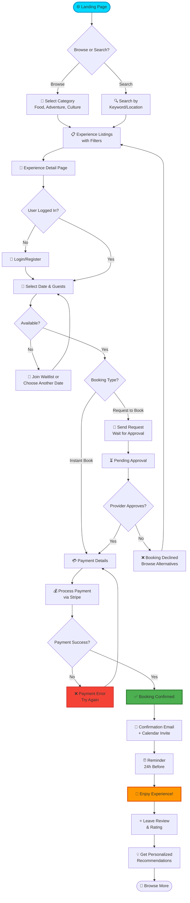
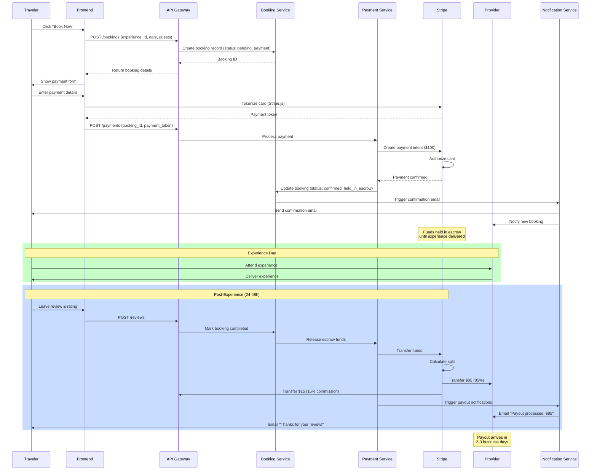
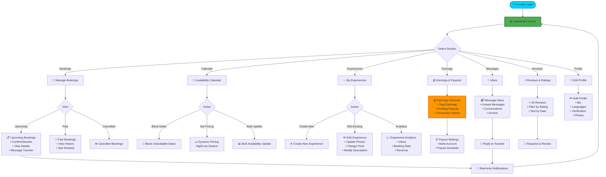

# 👤 MayaGo - User Flow Diagrams

## 1. Traveler Booking Flow



---

## 2. Provider Onboarding Flow

```mermaid
graph TD
    START([📱 Hear About Platform]) --> INTEREST[💡 Visit Provider Page]
    
    INTEREST --> APPLY[📝 Apply to Become Provider]
    
    APPLY --> FORM[📋 Fill Application Form<br/>• Name, Contact<br/>• Experience Type<br/>• Location<br/>• Brief Description]
    
    FORM --> SUBMIT[📤 Submit Application]
    
    SUBMIT --> REVIEW[👀 MayaGo Team<br/>Reviews Application]
    
    REVIEW --> DECISION{Application Status}
    
    DECISION -->|Rejected| REJECT[❌ Rejection Email<br/>with Feedback]
    REJECT --> REAPPLY{Reapply?}
    REAPPLY -->|Yes| FORM
    REAPPLY -->|No| END_REJECT([End])
    
    DECISION -->|Approved| APPROVE[✅ Approval Email<br/>+ Welcome Kit]
    
    APPROVE --> TRAINING[🎓 Attend Training<br/>• Platform Tutorial<br/>• Best Practices<br/>• Safety Guidelines]
    
    TRAINING --> ACCOUNT[🔐 Create Account<br/>Set Password]
    
    ACCOUNT --> PROFILE[👤 Build Profile]
    
    PROFILE --> PROFILE_STEPS[📝 Profile Setup<br/>• Bio & Story<br/>• Languages<br/>• Certifications<br/>• Availability]
    
    PROFILE_STEPS --> EXPERIENCE[✨ Create First Experience]
    
    EXPERIENCE --> EXP_DETAILS[📄 Experience Details<br/>• Title & Description<br/>• Duration & Price<br/>• What's Included<br/>• Meeting Point<br/>• Cancellation Policy]
    
    EXP_DETAILS --> PHOTOS[📸 Upload Photos<br/>Min 5 high-quality<br/>images]
    
    PHOTOS --> VERIFY[✅ Submit for<br/>Verification]
    
    VERIFY --> QUALITY_CHECK[🔍 Quality Control<br/>Check]
    
    QUALITY_CHECK --> QC_RESULT{Meets Standards?}
    
    QC_RESULT -->|No| FEEDBACK[📝 Feedback Provided<br/>Request Changes]
    FEEDBACK --> PHOTOS
    
    QC_RESULT -->|Yes| LIVE[🎉 Experience Goes LIVE!]
    
    LIVE --> DASHBOARD[📊 Access Dashboard<br/>• Manage Calendar<br/>• View Bookings<br/>• Track Earnings<br/>• Read Reviews]
    
    DASHBOARD --> FIRST_BOOKING[🎯 Await First Booking]
    
    FIRST_BOOKING --> NOTIFICATION[🔔 Booking Received!]
    
    NOTIFICATION --> ACCEPT{Accept Booking?}
    
    ACCEPT -->|No| DECLINE[❌ Decline & Explain]
    DECLINE --> FIRST_BOOKING
    
    ACCEPT -->|Yes| PREPARE[📋 Prepare for<br/>Experience]
    
    PREPARE --> DELIVER[🎉 Deliver Experience]
    
    DELIVER --> GET_REVIEW[⭐ Receive Review<br/>from Traveler]
    
    GET_REVIEW --> PAYOUT[💰 Receive Payout<br/>85% of Booking Value]
    
    PAYOUT --> GROW[📈 Optimize & Grow<br/>• Add More Experiences<br/>• Improve Based on Feedback<br/>• Build Reputation]
    
    GROW --> END([🔄 Continue Hosting])
    
    style START fill:#00D9FF,stroke:#0099CC,stroke-width:3px
    style LIVE fill:#4CAF50,stroke:#2E7D32,stroke-width:3px
    style REJECT fill:#f44336,stroke:#c62828,stroke-width:2px
    style PAYOUT fill:#FF9800,stroke:#E65100,stroke-width:3px
```



---

## 3. Search & Discovery Flow

```mermaid
graph TD
    START([🏠 Homepage]) --> INTENT{User Intent}
    
    INTENT -->|Explore| EXPLORE[🌍 Browse by Category<br/>• Food & Cooking<br/>• Adventure & Nature<br/>• Culture & Traditions<br/>• Art & Crafts]
    
    INTENT -->|Know What They Want| SEARCH[🔍 Use Search Bar]
    
    EXPLORE --> CATEGORY_PAGE[📂 Category Results]
    
    SEARCH --> SEARCH_TYPE{Search Type}
    
    SEARCH_TYPE -->|Keyword| KEYWORD[💬 "cenote tour"<br/>"cooking class"<br/>"mayan ruins"]
    
    SEARCH_TYPE -->|Location| LOCATION[📍 "Merida"<br/>"Valladolid"<br/>"Uxmal"]
    
    KEYWORD --> RESULTS[📋 Search Results]
    LOCATION --> RESULTS
    CATEGORY_PAGE --> RESULTS
    
    RESULTS --> FILTERS{Apply Filters?}
    
    FILTERS -->|Yes| FILTER_OPTIONS[⚙️ Filter Options<br/>• Price Range<br/>• Duration<br/>• Date Available<br/>• Rating (4+ stars)<br/>• Group Size<br/>• Language]
    
    FILTER_OPTIONS --> RESULTS
    
    FILTERS -->|No| SORT[📊 Sort Results<br/>• Recommended<br/>• Price (Low to High)<br/>• Rating<br/>• Distance]
    
    SORT --> VIEW_RESULTS[👀 View Filtered Results]
    
    VIEW_RESULTS --> SELECT[📄 Click Experience]
    
    SELECT --> DETAIL[📱 Experience Detail Page]
    
    DETAIL --> ACTIONS{User Action}
    
    ACTIONS -->|Save| WISHLIST[❤️ Save to Wishlist]
    WISHLIST --> CONTINUE[🔄 Continue Browsing]
    
    ACTIONS -->|Share| SHARE[📤 Share via<br/>WhatsApp, Email, Copy Link]
    SHARE --> CONTINUE
    
    ACTIONS -->|Book| BOOKING[📅 Start Booking Process]
    
    ACTIONS -->|Message| MESSAGE[💬 Message Provider<br/>Ask Questions]
    MESSAGE --> RESPONSE[⏳ Wait for Response]
    RESPONSE --> BOOKING
    
    CONTINUE --> RESULTS
    
    BOOKING --> END([✅ Proceed to Booking])
    
    style START fill:#00D9FF,stroke:#0099CC,stroke-width:3px
    style BOOKING fill:#4CAF50,stroke:#2E7D32,stroke-width:3px
    style DETAIL fill:#FF9800,stroke:#E65100,stroke-width:2px
```

---

## 4. Payment & Escrow Flow



---

## 5. Review & Rating System Flow

```mermaid
graph TD
    START([✅ Booking Completed]) --> WAIT[⏰ Wait 24 Hours<br/>After Experience]
    
    WAIT --> EMAIL[📧 Review Request Email<br/>"How was your experience?"]
    
    EMAIL --> CLICK{User Clicks?}
    
    CLICK -->|No| REMINDER1[📧 Reminder Email<br/>Day 3]
    REMINDER1 --> CLICK2{User Clicks?}
    CLICK2 -->|No| REMINDER2[📧 Final Reminder<br/>Day 7]
    REMINDER2 --> CLICK3{User Clicks?}
    CLICK3 -->|No| EXPIRED[⏹️ Review Period Expired<br/>Can Still Leave Review Later]
    
    CLICK -->|Yes| REVIEW_PAGE[⭐ Review Page]
    CLICK2 -->|Yes| REVIEW_PAGE
    CLICK3 -->|Yes| REVIEW_PAGE
    
    REVIEW_PAGE --> RATING[⭐ Select Rating<br/>1-5 Stars]
    
    RATING --> ASPECTS[📊 Rate Specific Aspects<br/>• Accuracy of Description<br/>• Communication<br/>• Value for Money<br/>• Overall Experience]
    
    ASPECTS --> COMMENT[💬 Write Review<br/>(Optional but Encouraged)]
    
    COMMENT --> PHOTOS_Q{Add Photos?}
    
    PHOTOS_Q -->|Yes| UPLOAD[📸 Upload Photos<br/>Max 5 photos]
    UPLOAD --> PREVIEW
    
    PHOTOS_Q -->|No| PREVIEW[👀 Preview Review]
    
    PREVIEW --> SUBMIT_Q{Ready to Submit?}
    
    SUBMIT_Q -->|Edit| RATING
    SUBMIT_Q -->|Submit| SUBMIT[📤 Submit Review]
    
    SUBMIT --> MODERATION[🔍 Auto-Moderation Check<br/>• Profanity Filter<br/>• Spam Detection]
    
    MODERATION --> MOD_RESULT{Flagged?}
    
    MOD_RESULT -->|Yes| MANUAL_REVIEW[👀 Manual Review<br/>by Team]
    MANUAL_REVIEW --> APPROVED{Approved?}
    APPROVED -->|No| REJECT[❌ Review Rejected<br/>Email Explanation]
    REJECT --> END_REJECT([End])
    
    MOD_RESULT -->|No| PUBLISH[✅ Review Published]
    APPROVED -->|Yes| PUBLISH
    
    PUBLISH --> NOTIFY_PROVIDER[🔔 Notify Provider<br/>"You have a new review!"]
    
    NOTIFY_PROVIDER --> PROVIDER_RESPONSE{Provider Responds?}
    
    PROVIDER_RESPONSE -->|Yes| RESPONSE[💬 Provider Public Response]
    RESPONSE --> UPDATE_LISTING
    
    PROVIDER_RESPONSE -->|No| UPDATE_LISTING[📊 Update Experience<br/>Average Rating]
    
    UPDATE_LISTING --> UPDATE_PROVIDER[👤 Update Provider<br/>Overall Rating]
    
    UPDATE_PROVIDER --> ANALYTICS[📈 Update Analytics<br/>• Trending Experiences<br/>• Quality Scores]
    
    ANALYTICS --> RECOMMENDATIONS[💡 Update Recommendation<br/>Algorithm]
    
    RECOMMENDATIONS --> THANK_YOU[🎉 Thank Traveler<br/>Offer Discount on Next Booking]
    
    THANK_YOU --> TWO_WAY{Provider Reviews<br/>Traveler?}
    
    TWO_WAY -->|Yes| MUTUAL[⭐ Two-way Review Complete]
    TWO_WAY -->|No| ONE_WAY[⭐ One-way Review Only]
    
    MUTUAL --> END([🔄 Complete])
    ONE_WAY --> END
    
    style START fill:#00D9FF,stroke:#0099CC,stroke-width:3px
    style PUBLISH fill:#4CAF50,stroke:#2E7D32,stroke-width:3px
    style REJECT fill:#f44336,stroke:#c62828,stroke-width:2px
    style THANK_YOU fill:#FF9800,stroke:#E65100,stroke-width:3px
```

---

## 6. Provider Dashboard Flow



---

## 7. Mobile Experience Flow (PWA)

```mermaid
graph TD
    START([📱 Open mayago.com<br/>on Mobile]) --> PWA_PROMPT{Install App Prompt}
    
    PWA_PROMPT -->|Dismiss| BROWSER[🌐 Use Web Version]
    PWA_PROMPT -->|Install| INSTALL[📲 Add to Home Screen]
    
    INSTALL --> ICON[📱 App Icon on Home]
    ICON --> OPEN[🚀 Open MayaGo App]
    
    OPEN --> SPLASH[🎨 Splash Screen<br/>MayaGo Logo]
    SPLASH --> CHECK_NETWORK{Internet Connection?}
    
    CHECK_NETWORK -->|Offline| OFFLINE[📴 Offline Mode<br/>• View Saved Experiences<br/>• Read Past Bookings<br/>• Browse Cached Content]
    
    CHECK_NETWORK -->|Online| MAIN[🏠 Main App]
    
    OFFLINE --> RECONNECT{Connection Restored?}
    RECONNECT -->|Yes| SYNC[🔄 Sync Data]
    SYNC --> MAIN
    RECONNECT -->|No| OFFLINE
    
    BROWSER --> MAIN
    
    MAIN --> FEATURES{Feature Access}
    
    FEATURES -->|Location| LOCATION[📍 Use GPS<br/>Find Nearby Experiences]
    FEATURES -->|Camera| CAMERA[📸 Take Photos<br/>For Reviews]
    FEATURES -->|Notifications| PUSH[🔔 Push Notifications<br/>• Booking Reminders<br/>• Message Alerts<br/>• Special Offers]
    FEATURES -->|Share| NATIVE_SHARE[📤 Native Share Sheet<br/>Share Experiences]
    
    LOCATION --> MAP[🗺️ Interactive Map View]
    CAMERA --> REVIEW_PHOTO[⭐ Add Photo to Review]
    PUSH --> ENGAGE[🎯 User Engagement]
    NATIVE_SHARE --> VIRAL[🚀 Viral Growth]
    
    MAP --> BOOK[📅 Book Experience]
    REVIEW_PHOTO --> SUBMIT_REVIEW[📤 Submit Review]
    
    BOOK --> CONFIRMATION[✅ Booking Confirmed]
    CONFIRMATION --> WALLET[💳 Add to Apple/Google Wallet]
    
    WALLET --> REMINDER[⏰ Automatic Reminder]
    REMINDER --> ENJOY[🎉 Enjoy Experience]
    
    ENJOY --> OFFLINE_REVIEW[📝 Write Review<br/>(Works Offline)]
    OFFLINE_REVIEW --> QUEUE[📋 Queue for Upload]
    QUEUE --> RECONNECT
    
    style START fill:#00D9FF,stroke:#0099CC,stroke-width:3px
    style INSTALL fill:#4CAF50,stroke:#2E7D32,stroke-width:3px
    style OFFLINE fill:#FF9800,stroke:#E65100,stroke-width:2px
```

---

## 📊 Conversion Funnel Analysis

### Key Metrics at Each Stage

| Stage | Conversion Rate | Drop-off | Optimization Priority |
|-------|-----------------|----------|---------------------|
| **Landing → Browse** | 65% | 35% | Improve hero section |
| **Browse → Detail** | 45% | 55% | Better thumbnails |
| **Detail → Start Booking** | 30% | 70% | 🔴 **High Priority** |
| **Start → Complete Payment** | 75% | 25% | Streamline checkout |
| **Payment → Confirmed** | 95% | 5% | Payment options |
| **Confirmed → Attended** | 90% | 10% | Reminders |
| **Attended → Reviewed** | 40% | 60% | 🟡 **Medium Priority** |

### Optimization Strategies

1. **Detail → Booking** (30% conversion, biggest opportunity)
   - Add "Limited Availability" urgency
   - Show recent bookings ("3 people booked today")
   - Improve call-to-action button
   - Add trust badges (verified, 500+ reviews)

2. **Attended → Reviewed** (40% conversion)
   - Gamification (points for reviews)
   - Easier review process (one-tap rating)
   - Incentives (5% discount on next booking)

---

## 🎯 User Journey Touchpoints

### Pre-Booking
1. **Discovery**: Social media, SEO, word-of-mouth
2. **Research**: Read reviews, compare options
3. **Decision**: Check availability, price

### Booking
4. **Payment**: Secure checkout
5. **Confirmation**: Email + SMS

### Experience
6. **Reminder**: 24h before
7. **Check-in**: Meet provider
8. **Delivery**: Enjoy experience

### Post-Experience
9. **Review Request**: 24h after
10. **Recommendation**: Personalized suggestions
11. **Re-engagement**: Newsletter, offers

---

<div align="center">

**User flows designed for: Simplicity 🎯 | Trust 🔒 | Delight ✨**

</div>